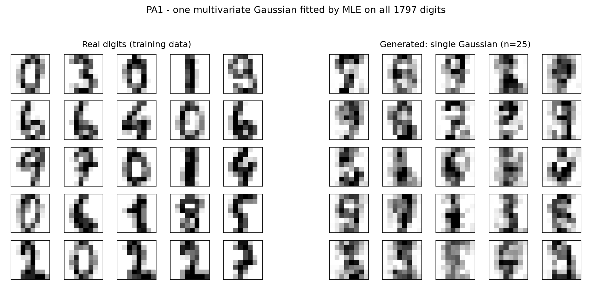
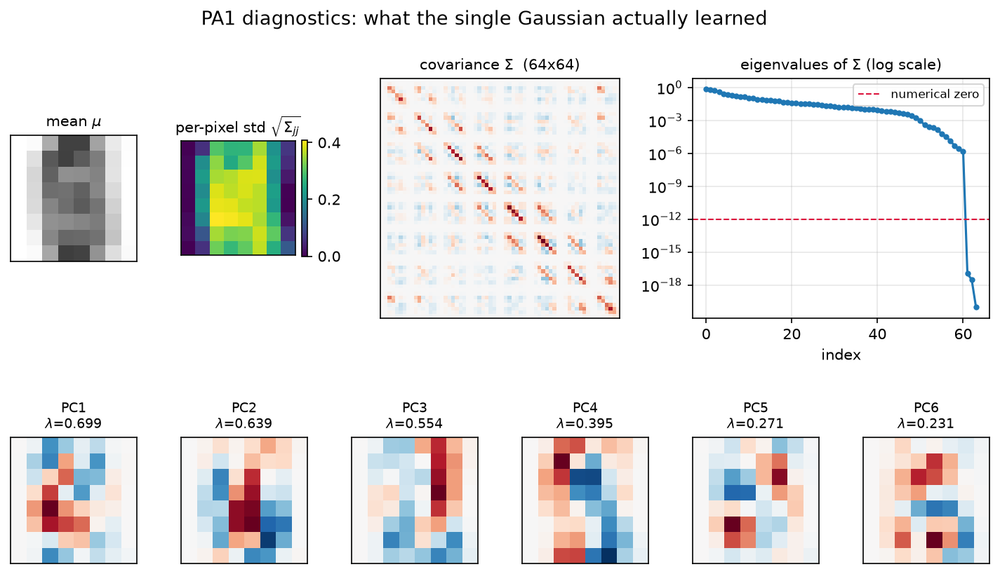

# PA1 — Fit a Multivariate Gaussian to Images

> 실행: `python pa1.py` · 전체 출력 로그: [`outputs/pa1_log.txt`](outputs/pa1_log.txt)
> 결과 그림: [`outputs/pa1_real_vs_generated.png`](outputs/pa1_real_vs_generated.png), [`outputs/pa1_diagnostics.png`](outputs/pa1_diagnostics.png)

---

## 1. 과제 요구사항과 처리 결과

| 요구사항 | 처리 | 확인된 값 |
|---|---|---|
| `load_digits()` 로드, 0–16 → 0–1 정규화 | `images / 16.0` | 원본 `[0, 16]` → 정규화 후 `[0.0000, 1.0000]` |
| 8×8 이미지를 x ∈ R⁶⁴ 로 flatten | `images.reshape(n, -1)` | `(1797, 8, 8)` → `(1797, 64)` |
| MLE로 multivariate Gaussian 1개 fit | `μ`, `Σ` 직접 계산 | `μ ∈ R⁶⁴`, `Σ ∈ R⁶⁴ˣ⁶⁴` |
| 20개 이상 샘플 생성 → 8×8 reshape → 시각화 | 25개 생성 | `pa1_real_vs_generated.png` |

flatten이 맞는지는 직접 만든 `X * 16`이 sklearn이 제공하는 `digits.data`와 일치하는지로 검증했습니다 (`True`).

---

## 2. MLE 수식과 구현

Multivariate Gaussian `N(x; μ, Σ)`의 log-likelihood를 `μ`, `Σ`에 대해 미분해 0으로 놓으면 닫힌 해가 나옵니다.

```
μ_MLE = (1/N) Σᵢ xᵢ
Σ_MLE = (1/N) Σᵢ (xᵢ − μ)(xᵢ − μ)ᵀ
```

**여기서 놓치기 쉬운 포인트: 분모가 `1/N`이지 `1/(N−1)`이 아닙니다.**
`1/(N−1)`은 *unbiased estimator*(`np.cov`의 기본값)이고, `1/N`이 *likelihood를 최대화하는* 값입니다. 과제가 "using MLE"라고 명시했으므로 `1/N`이 맞습니다. 그래서 코드에서 `np.cov(..., bias=True)`에 해당하는 계산을 직접 했습니다.

---

## 3. 여기서 걸리는 진짜 문제 — Σ가 singular

`Σ`의 eigenvalue를 뽑아보면:

```
eigenvalue range        : [0.000e+00, 6.989e-01]
numerical rank of Sigma : 61 / 64   -> SINGULAR
pixels with zero variance : 3
```

**이유:** 8×8 digits 이미지에서 어떤 픽셀(주로 모서리)은 1797장 전부에서 값이 0입니다. 그 픽셀 `j`는 분산 `Σ_jj = 0`이고, 따라서 `Σ`의 행/열 전체가 0이 되어 행렬이 rank deficient가 됩니다. 실제로 분산이 정확히 0인 픽셀이 3개 있고, rank가 정확히 61 = 64 − 3입니다.

이게 왜 중요하냐면:

1. **`np.linalg.cholesky(Σ)`가 실패합니다.** Cholesky는 positive *definite*를 요구하는데 이건 positive *semi*-definite입니다.
2. **`Σ⁻¹`이 존재하지 않습니다.** 그래서 이 모델의 density는 R⁶⁴ 위에서 정의되지 않습니다 (PA2에서 log-likelihood를 계산할 때 이 문제를 regularization으로 처리합니다).

### 해결: eigendecomposition으로 샘플링

`Σ`는 대칭이므로 `Σ = V diag(λ) Vᵀ`가 **항상** 존재합니다 (λ ≥ 0). 여기서

```
A = V diag(√λ)      →      A Aᵀ = V diag(λ) Vᵀ = Σ
x = μ + A z,   z ~ N(0, I)
```

이면 `E[x] = μ`, `Cov[x] = A Aᵀ = Σ`가 됩니다. `λ_j = 0`인 방향은 `√λ_j = 0`이라 그 방향으로는 아무 변동도 생성되지 않습니다 — 즉 **항상 0이던 픽셀은 생성 샘플에서도 정확히 0으로 나옵니다.** 이건 버그가 아니라 학습한 분포를 정확히 반영한 결과입니다 (degenerate Gaussian: 모든 확률질량이 61차원 affine subspace 위에 있음).

> **여기 숨어 있던 수치 함정 (PA2에서 실제로 잡은 버그).**
> `Σ_jj = 0`이면 `(AAᵀ)_jj = 0`이므로 `A`의 `j`번째 **행**은 이론상 정확히 0이어야 합니다. 그런데 `np.linalg.eigh`의 반올림 오차 때문에 실제 행 norm이 `~3e-9`로 남습니다. 그러면 그 픽셀이 `0 ± 3e-9`로 미세하게 흔들리는데, 하필 상수값이 경계인 0이라 **절반이 음수**가 되어 PA2의 "픽셀 범위" 통계를 오염시켰습니다.
> 그래서 `A[diag(Σ) ≤ 1e-12, :] = 0` 한 줄로 결정론적 픽셀의 행을 정확히 0으로 강제했습니다. 오차를 숨긴 게 아니라 **수학적으로 참인 제약을 명시**한 것입니다. 자세한 추적 과정은 [PA2 리포트 B.3](../pa2_conditional_gaussian/REPORT_PA2.md)에 있습니다.

> **대안과 트레이드오프**
> - **(택함) 정확한 degenerate 샘플링**: `Σ`를 손대지 않음. MLE 분포 그 자체에서 샘플링하는 것이므로 과제 요구에 정확히 부합. 단점: density 계산 불가.
> - **jitter (`Σ + λI`)**: Cholesky/역행렬이 가능해져 density를 쓸 수 있음. 단점: **모델을 바꿔버림** — 원래 0이던 픽셀에 없던 노이즈가 생김. PA2의 log-likelihood 평가에서만 이 방법을 씁니다.
> - **`np.random.multivariate_normal`**: 내부적으로 SVD를 써서 동작은 하지만 non-PSD 경고를 뱉고, 무슨 일이 일어나는지 감춰집니다. 과제의 핵심이 "Gaussian을 이해하는 것"이라 직접 구현했습니다.

---

## 4. 샘플러가 맞다는 증거

"그림이 그럴듯하다"는 검증이 아닙니다. 샘플러가 진짜 `N(μ, Σ)`에서 뽑는지 수치로 확인했습니다.

```
||A A^T - Sigma|| / ||Sigma||                  : 1.859e-15    ← A Aᵀ가 Σ를 정확히 복원
100000 samples -> rel. error of mean           : 1.468e-03    ← 표본평균 → μ 수렴
100000 samples -> rel. error of covariance     : 1.175e-02    ← 표본공분산 → Σ 수렴
```

10만 개를 뽑아 표본 평균/공분산을 다시 계산했더니 `μ`, `Σ`로 수렴합니다. 오차 크기도 몬테카를로 오차 `O(1/√N) ≈ 3e-3` 수준으로 이론과 일치합니다. 스크립트 끝에 assertion으로 걸어놨고 `ALL CHECKS PASSED`가 나옵니다.

---

## 5. 생성 결과 해석



**관찰:** 생성된 샘플들은 "숫자 같은 얼룩"이지 읽을 수 있는 숫자가 아닙니다. 세로로 긴 획, 가운데가 진하고 가장자리가 흐린 구조까지는 잡았지만 특정 숫자로 식별되지 않습니다.

**이게 정상이고, 이유는 단일 Gaussian의 구조적 한계입니다:**

1. **Unimodal vs multimodal.** 실제 `p(x)`는 10개 숫자에 대응하는 최소 10개의 mode를 가진 분포입니다. Gaussian은 mode가 하나뿐이라, 평균 `μ`를 10개 숫자의 *평균 이미지*에 놓을 수밖에 없습니다. 진단 그림의 `mean μ`가 정확히 그 흐릿한 세로 획입니다.
2. **가장 높은 density 지점이 실제 데이터가 없는 곳입니다.** Gaussian이 샘플을 가장 많이 뽑는 곳은 `μ` 근처인데, 실제 숫자 중 "모든 숫자의 평균"처럼 생긴 것은 없습니다. 즉 이 모델은 **실제 데이터가 존재하지 않는 영역에 확률질량을 몰아줍니다.**
3. **Covariance가 클래스 간 변동까지 흡수합니다.** `Σ`는 "0과 1이 다르게 생긴 것"과 "같은 1끼리 조금 다른 것"을 구분하지 못하고 하나로 뭉뚱그립니다. 그래서 샘플이 여러 숫자의 특징이 섞인 형태로 나옵니다. → **이 문제를 정확히 해결하는 것이 PA2의 class-conditional 모델입니다.**



- `mean μ`: 모든 숫자의 평균 → 흐릿한 세로 획.
- `per-pixel std`: 가운데 픽셀은 변동이 크고(노랑), 모서리는 0(보라). 이 보라색 모서리가 위에서 말한 singularity의 원인입니다.
- `eigenvalues`: 61번째 이후 값이 `1e-18` 수준으로 절벽처럼 떨어집니다 — rank 61의 시각적 증거.
- `PC1~PC6`: Gaussian이 학습한 주요 변동 방향. 획의 굵기, 좌우 기울기 같은 패턴이 보입니다.

## 6. 미리 짚어둘 점 — 픽셀 값 범위

```
generated value range            : [-0.7720, 1.5563]
fraction of pixels outside [0,1] : 26.438%     (25개 샘플 기준)
```

학습 데이터는 `[0, 1]`에 갇혀 있는데 생성 샘플은 음수와 1 초과 값을 냅니다. Gaussian의 support가 R⁶⁴ 전체라 필연적인 현상이고, **PA2 두 번째 문항에서 이 부분을 정량적으로 분석**합니다.
