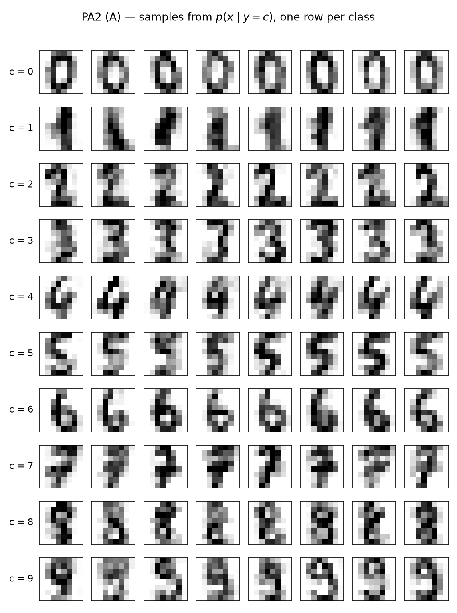
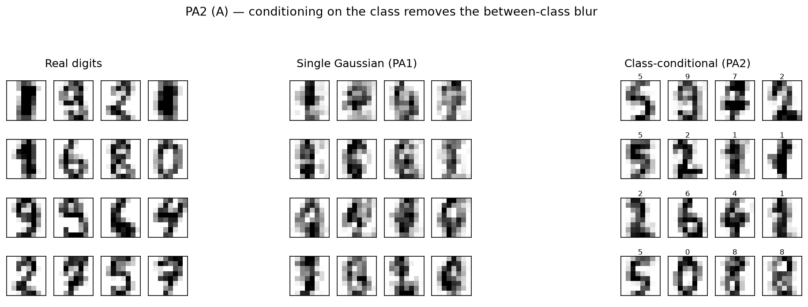
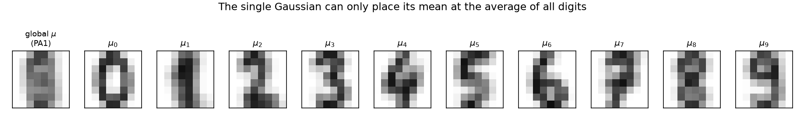
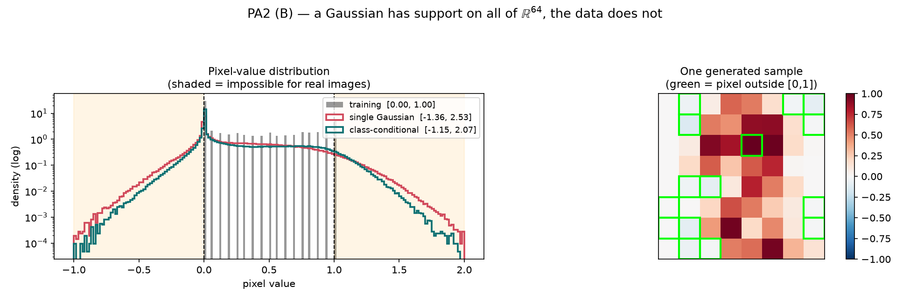

# PA2 — Class-conditional Gaussians & Pixel-value Ranges

> 실행: `python pa2.py` · 전체 출력 로그: [`outputs/pa2_log.txt`](outputs/pa2_log.txt)
> PA1(단일 Gaussian) 결과는 [`../pa1_single_gaussian/REPORT_PA1.md`](../pa1_single_gaussian/REPORT_PA1.md) 참고

---

# 문항 A — 10개의 class-conditional Gaussian

## A.1 모델

각 클래스 `c`에 대해 그 클래스 데이터만으로 따로 MLE를 합니다.

```
π_c   = N_c / N                                    (class prior)
μ_c   = (1/N_c) Σ_{i: y_i = c} x_i
Σ_c   = (1/N_c) Σ_{i: y_i = c} (x_i − μ_c)(x_i − μ_c)ᵀ
```

생성은 2단계입니다: **① `c ~ p(y)` 뽑기 → ② `x ~ N(μ_c, Σ_c)` 뽑기.**
(`c`를 고정하면 그게 "conditioned on c" 생성입니다.)

| c | N_c | prior | rank(Σ_c) | tr(Σ_c) |
|---|---|---|---|---|
| 0 | 178 | 0.0991 | 48/64 | 1.5482 |
| 1 | 182 | 0.1013 | 51/64 | 3.6744 |
| 2 | 177 | 0.0985 | 54/64 | 2.9344 |
| 3 | 183 | 0.1018 | 54/64 | 2.4751 |
| 4 | 181 | 0.1007 | 53/64 | 2.8761 |
| 5 | 182 | 0.1013 | 51/64 | 2.9585 |
| 6 | 181 | 0.1007 | 48/64 | 2.0035 |
| 7 | 179 | 0.0996 | 49/64 | 2.8701 |
| 8 | 174 | 0.0968 | 52/64 | 2.8952 |
| 9 | 180 | 0.1002 | 54/64 | 2.9442 |

**주목할 점:**
- 모든 `Σ_c`가 PA1의 `Σ`(rank 61)보다 **더 심하게 singular**합니다 (rank 48~54). 클래스당 데이터가 ~180개뿐이라 그 클래스에서 항상 0인 픽셀이 훨씬 많기 때문입니다. → PA1과 동일한 eigendecomposition 샘플러가 그대로 필요합니다.
- `tr(Σ_c)`가 전부 `tr(Σ_total) = 4.69`보다 작습니다. 즉 **클래스 안에서의 변동이 전체 변동보다 훨씬 작습니다.** 이게 다음 절의 핵심입니다.

## A.2 생성 결과



각 행이 하나의 클래스입니다. **PA1과 달리 대부분 읽을 수 있는 숫자**입니다 — 0의 구멍, 1의 세로획, 6의 아래쪽 고리 같은 클래스 고유 구조가 살아 있습니다.



## A.3 왜 conditioning이 도움이 되는가 — *law of total covariance*

이건 직관이 아니라 **항등식**입니다. 전체 공분산은 정확히 두 조각으로 쪼개집니다.

```
Σ_total  =  Σ_c π_c Σ_c        +      Σ_c π_c (μ_c − μ)(μ_c − μ)ᵀ
            └── within-class ──┘      └──── between-class ────┘
            "같은 숫자끼리의 차이"       "숫자 종류가 다른 데서 오는 차이"
```

코드에서 이 항등식이 실제로 성립하는지 확인했습니다 (`||lhs − rhs|| / ||rhs|| = 4.17e-16`, 즉 부동소수점 오차 수준으로 정확). 그리고 trace로 크기를 재면:

```
trace(Σ_total)                : 4.6933
trace(within-class)           : 2.7189   (57.9%)
trace(between-class)          : 1.9744   (42.1%)
```

**결론: PA1의 단일 Gaussian이 가진 분산 중 42.1%는 "숫자 모양의 다양성"이 아니라 "어떤 숫자냐"에서 오는 것입니다.**

단일 Gaussian은 이 두 종류의 변동을 구분할 수단이 없어서 하나의 `Σ`에 뭉쳐 넣습니다. 그 결과:

1. **평균이 아무 숫자도 아닌 곳에 놓입니다.** 아래 그림에서 왼쪽 `global μ`가 흐릿한 세로 얼룩인데, 이건 0~9 어느 것도 아닙니다. 그런데 Gaussian은 여기서 확률밀도가 가장 높습니다 → **데이터가 없는 곳에서 샘플을 가장 많이 뽑습니다.**
2. **between-class 방향으로 샘플이 흘러갑니다.** `μ` 에서 `μ_0` 방향과 `μ_1` 방향 사이 중간 지점은 Gaussian 입장에서는 확률이 높지만, 실제로는 "0과 1을 섞은 것"이라 어떤 숫자도 아닙니다.



`p(x | y=c)`로 조건을 걸면 between-class 항이 **통째로 사라지고** `Σ_c` (within-class only) 만 남습니다. 모드가 하나뿐인 Gaussian이 이제 실제로 단봉인 대상(한 숫자 클래스)을 모델링하게 되므로 unimodal 가정이 맞아떨어집니다. 전체적으로 보면 이 모델은 **10개 Gaussian의 mixture**이고, `p(x) = Σ_c π_c N(x; μ_c, Σ_c)`는 다봉 분포를 표현할 수 있습니다.

## A.4 품질 비교 — 눈으로 말고 숫자로

"더 좋아 보인다"는 근거가 약하므로, 서로 독립적인 3가지 지표로 측정했습니다.

### 지표 1 — held-out log-likelihood (높을수록 좋음)

| 모델 | 선택된 λ | test LL / sample |
|---|---|---|
| 단일 Gaussian | 1.00e-06 | **11.080** |
| class-conditional mixture | 1.00e-05 | **68.463** |
| | | **+57.383 nats/sample** |

> **주의 (정직하게 밝힐 점):** MLE `Σ`가 singular라서 R⁶⁴ 위의 density가 정의되지 않습니다. 그래서 **likelihood 평가에 한해** `Σ + λI`로 regularize했습니다. λ는 validation split에서 골랐고 test split은 건드리지 않았습니다. 두 모델에 완전히 동일한 절차를 적용했으므로 비교는 공정합니다. 데이터는 train 1078 / val 359 / test 360으로 나눴습니다.

한 번도 본 적 없는 실제 숫자 이미지에 conditional 모델이 훨씬 높은 확률을 부여합니다.

### 지표 2 — oracle classifier (실제 데이터로 학습한 판정자)

진짜 학습 데이터로 logistic regression을 학습시켜 (실제 test 정확도 **96.7%** — 판정자로 쓸 만함), 생성 샘플을 평가했습니다.

| | 단일 Gaussian | class-conditional |
|---|---|---|
| 의도한 클래스 `c`로 분류된 비율 | (해당 없음) | **98.8%** |
| 평균 최대 클래스 확률 | 0.625 | **0.907** |
| 평균 predictive entropy | 1.039 nats | **0.360 nats** |

- **98.8%**: `c=7`로 조건을 걸고 뽑은 샘플을 분류기가 실제로 7로 인식합니다. → conditioning이 의도한 대로 작동합니다.
- 단일 Gaussian 샘플은 entropy가 3배 가까이 높습니다. 분류기가 "이게 뭔지 모르겠다"고 말하는 것 — 즉 **여러 숫자의 특징이 섞인 애매한 이미지**라는 뜻이고, 눈으로 본 인상과 일치합니다.

### 지표 3 — 실제 이미지까지의 최근접 거리 (낮을수록 좋음)

| | 평균 L2 거리 |
|---|---|
| 진짜 held-out 이미지 (기준선) | **1.089** |
| 단일 Gaussian 샘플 | 1.814 |
| class-conditional 샘플 | **1.344** |

기준선(1.089)은 "진짜 데이터끼리도 이 정도는 떨어져 있다"는 하한입니다. Conditional 샘플은 거의 그 수준까지 근접한 반면, 단일 Gaussian 샘플은 데이터가 있는 영역에서 한참 벗어나 있습니다.

**세 지표가 모두 같은 방향을 가리킵니다.**

---

# 문항 B — 픽셀 값 범위 비교

## B.1 측정 결과

각 20,000개 샘플(=1,280,000 픽셀) 기준입니다.

| source | **minimum** | **maximum** | [0,1] 밖 픽셀 비율 |
|---|---|---|---|
| **training images** | **0.0000** | **1.0000** | 0.00% |
| **generated — single Gaussian** | **−1.3625** | **2.5253** | 25.64% |
| **generated — class-conditional** | **−1.1519** | **2.0698** | 18.98% |

세부:

| | 0 미만 | 1 초과 |
|---|---|---|
| 단일 Gaussian | 20.21% | 5.43% |
| class-conditional | 13.72% | 5.26% |



## B.2 관찰된 차이 3가지

**① 학습 데이터는 `[0, 1]`에 정확히 갇혀 있지만, 생성 샘플은 양쪽으로 크게 벗어납니다.**
최소 −1.36, 최대 2.53. 픽셀 밝기로서 **물리적으로 의미가 없는 값**입니다 (음의 밝기, 흰색보다 밝은 값).

**② 아래쪽으로 새는 양이 위쪽보다 훨씬 많습니다** (20.21% vs 5.43%).

**③ class-conditional 모델이 단일 Gaussian보다 덜 벗어납니다** (18.98% vs 25.64%).

## B.3 fitted Gaussian 모델로 설명

### 왜 벗어나는가 — support의 불일치

Gaussian `N(μ, Σ)`의 support는 **R⁶⁴ 전체**입니다. 어떤 유한한 `μ`, `Σ`(`Σ ≠ 0`)를 골라도 모든 실수 값에 0이 아닌 확률밀도를 줍니다. 반면 실제 데이터는 `[0,1]⁶⁴`라는 **유계 집합** 안에만 존재합니다.

즉 이건 fitting을 잘못해서 생긴 오차가 아니라 **모델 가정 자체의 mismatch**입니다. 어떤 Gaussian도 유계 데이터를 정확히 표현할 수 없습니다.

정량적으로: 픽셀 `j`의 marginal 분포는 `x_j ~ N(μ_j, Σ_jj)`이므로,

```
P(x_j 가 [0,1] 밖)  =  Φ(−μ_j / σ_j)  +  Φ((μ_j − 1) / σ_j),    σ_j = √Σ_jj
```

**이 설명이 맞는지 검증했습니다** — 위 공식으로 계산한 이론값과, 실제로 20,000개를 뽑아 센 실측값을 비교하면:

| 모델 | 이론 예측 | 실측 | 차이 |
|---|---|---|---|
| 단일 Gaussian | 25.5939% | 25.6379% | 0.044%p |
| class-conditional | 18.9695% | 18.9786% | 0.009%p |

몬테카를로 오차 범위 안에서 일치합니다. → **"Gaussian의 marginal이 경계를 넘기 때문"이라는 설명이 정확히 원인입니다.**

### 왜 아래쪽이 더 심한가 — μ의 비대칭

`Φ(−μ_j/σ_j)`는 `μ_j`가 0에 가까울수록 커집니다 (μ_j = 0이면 정확히 50%). 8×8 숫자 이미지에서 **대부분의 픽셀은 배경**이라 `μ_j`가 0 근처에 몰려 있습니다 (PA1의 `mean μ` 그림에서 바깥쪽이 거의 하얀 것). 반대로 `μ_j`가 1 근처인 픽셀은 거의 없습니다 (`μ` 최댓값이 0.756).

`μ_j ≈ 0`이면서 `σ_j > 0`인 픽셀은 **정의상 절반이 음수로 나옵니다.** 그래서 음수 쪽 초과가 압도적입니다. 히스토그램에서 0 바로 왼쪽 밀도가 급격히 높은 것이 이 현상입니다.

### 왜 conditional이 덜 벗어나는가 — A.3과 직결

문항 A에서 봤듯 `Σ_c`는 within-class 변동만 담고 있어 `Σ_total`보다 작습니다 (trace 기준 57.9%). `σ_j`가 작아지면 `Φ(−μ_j/σ_j)`도 작아지므로 경계를 넘는 확률이 줄어듭니다. **A의 분산 분해가 B의 결과를 그대로 예측합니다** — 두 문항이 같은 원인의 두 측면입니다.

### 예외: 분산이 정확히 0인 픽셀

학습 데이터에서 항상 0인 픽셀 3개는 `Σ_jj = 0`이므로 생성값도 **정확히 0**이고, 절대 범위를 벗어나지 않습니다.

> **디버깅 기록 (이 부분에서 실제로 버그를 잡았습니다).**
> 처음 구현에서는 이론값 25.59% vs 실측 27.21%로 안 맞았고, conditional은 18.97% vs 27.17%로 크게 어긋났습니다. 픽셀별로 분해해보니 원인은 픽셀 32, 39였습니다:
> `Σ_jj = 0`이므로 `(AAᵀ)_jj = 0`, 즉 `A`의 해당 **행 norm이 0이어야** 하는데, `np.linalg.eigh`의 반올림 오차 때문에 실제로는 `3.3e-9`였습니다. 그래서 생성값이 `0 ± 3e-9`로 미세하게 흔들렸고, 그 값이 하필 경계 0에 걸쳐 있어서 **절반이 음수 = "범위 밖"으로 집계**됐습니다. 이 2개 픽셀이 격차 1.57%p 중 1.56%p를 차지했습니다.
> 수정: `A[diag(Σ) ≤ 1e-12, :] = 0`으로 결정론적 픽셀의 행을 정확히 0으로 강제. 수치 오차를 덮은 게 아니라 수학적으로 참인 제약을 명시한 것입니다. 수정 후 이론과 실측이 일치했습니다.

## B.4 그래서 어떻게 고칠 수 있나 (범위 밖 논의)

- **`np.clip(x, 0, 1)`**: 그림은 정상으로 보이지만 분포가 바뀝니다 — 0과 1에 delta 질량이 생기고 더 이상 Gaussian이 아닙니다. 시각화 용도로만 쓸 수 있습니다.
- **logit 변환 후 Gaussian fit**: `(0,1)`을 R로 보내 fit하고 다시 sigmoid로 되돌리면 **구조적으로 범위를 넘을 수 없습니다.** 다만 데이터에 정확히 0인 값이 많아 변환 전에 처리가 필요합니다.
- **Beta 분포 / truncated Gaussian**: 유계 support를 가정에 반영하는 정공법. 대신 닫힌 형태의 MLE가 사라져 수치 최적화가 필요합니다.

이번 과제의 목적은 Gaussian 모델의 특성과 한계를 관찰하는 것이므로 위 방법은 적용하지 않고 **한계를 그대로 측정해 보고**했습니다.

---

## 최종 요약

| 질문 | 답 |
|---|---|
| conditioning이 품질을 높이는가? | **예.** 3개 독립 지표 전부에서 개선 (LL +57.4 nats, entropy 1.039→0.360, NN거리 1.814→1.344) |
| 왜 도움이 되는가? | 단일 Gaussian의 분산 중 **42.1%가 between-class 변동**이고, 이건 숫자 모양이 아니라 "어떤 숫자냐"의 정보. conditioning은 이 항을 제거해 unimodal 가정을 성립시킴 |
| 픽셀 범위는? | training **[0.0000, 1.0000]** / single **[−1.3625, 2.5253]** / conditional **[−1.1519, 2.0698]** |
| 왜 벗어나는가? | Gaussian의 support가 R⁶⁴이라 유계 데이터와 구조적으로 불일치. `Φ(−μ_j/σ_j) + Φ((μ_j−1)/σ_j)` 공식이 실측을 0.05%p 이내로 예측함 |
